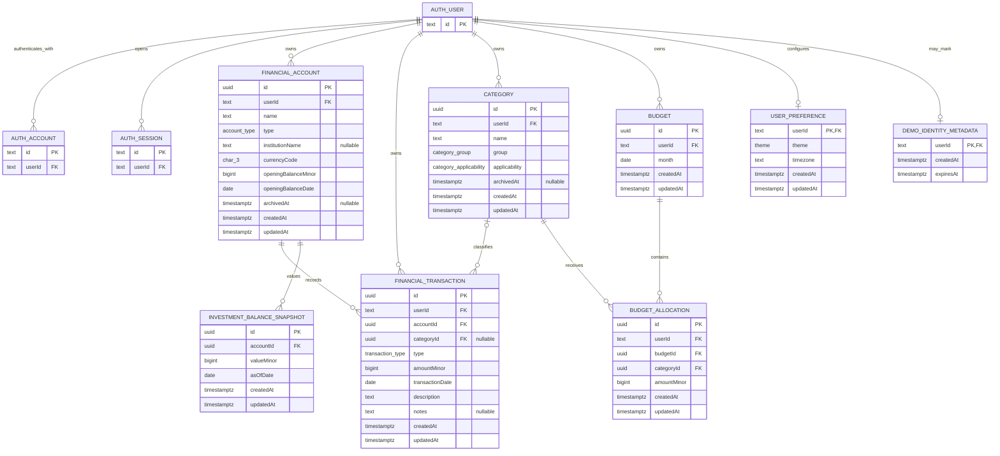

# Initial Financial Entity-Relationship Diagram

**Status:** Accepted
**Last verified:** 2026-08-03

## Purpose and Scope

This document is the implementation blueprint for Steward's initial PostgreSQL
schema. It consolidates the accepted domain decisions into one physical model
for Drizzle implementation. The entity-specific domain documents remain the
source of truth for field meaning, and
[financial rules](../domain/financial-rules.md) remain the only source of truth
for calculations.

The diagram includes the Better Auth records that establish identity and every
Steward-owned MVP entity. Better Auth generates its complete authentication
table shapes; only the identifiers and foreign keys that define Steward's
boundary are repeated here. Regenerate and review those tables from the pinned
Better Auth version before creating the initial migration.

## ERD

`FINANCIAL_TRANSACTION` is the physical table named `transaction` in the
domain documents. The longer diagram name prevents confusion with a database
transaction. Final SQL identifiers follow the repository's Drizzle naming
convention when the schema is implemented.

## Cardinality, Optionality, and Ownership

- A Better Auth user may own zero or many accounts, transactions, categories,
  and budgets. Each of those rows has exactly one owner.
- A user has zero or one preference row and zero or one demo metadata row. The
  absence of demo metadata means the user is a regular identity.
- Every transaction references exactly one financial account and optionally one
  category. Its copied `userId` must match both referenced roots.
- Every investment snapshot references exactly one financial account; an
  account may have zero or many snapshots. Ownership is inherited through that
  account.
- Every allocation references exactly one budget and one category; a budget and
  category may each be referenced by zero or many allocations. Allocation
  ownership is inherited through its budget. Its copied `userId` is only a
  constraint key and must match both parents.
- Better Auth authentication accounts and sessions belong to exactly one Better
  Auth user. Their full cardinality and lifecycle remain Better Auth-owned.

Protected operations derive the Better Auth user ID from the validated session.
A public request never supplies an authoritative owner ID. Child operations
authorize through the owning parent, and another user's resource behaves as not
found.

## Keys and Uniqueness

| Entity                      | Primary key | Additional unique constraint                      |
| --------------------------- | ----------- | ------------------------------------------------- |
| Financial account           | `id`        | `(id, userId)` for owner-qualified references     |
| Transaction                 | `id`        | None beyond the primary key                       |
| Category                    | `id`        | `(id, userId)` and `(userId, group, lower(name))` |
| Budget                      | `id`        | `(id, userId)` and `(userId, month)`              |
| Budget allocation           | `id`        | `(budgetId, categoryId)`                          |
| Investment balance snapshot | `id`        | `(accountId, asOfDate)`                           |
| User preference             | `userId`    | Primary key enforces the optional singleton       |
| Demo identity metadata      | `userId`    | Primary key enforces the optional singleton       |

The owner-qualified foreign keys are:

- `transaction.(accountId, userId) -> financial_account.(id, userId)`;
- nullable `transaction.(categoryId, userId) -> category.(id, userId)`;
- `budget_allocation.(budgetId, userId) -> budget.(id, userId)`; and
- `budget_allocation.(categoryId, userId) -> category.(id, userId)`.

The snapshot's single-parent foreign key is sufficient because ownership can
only be reached through its required account. Steward-owned root and singleton
`userId` values reference the Better Auth user identifier.

## Lifecycle and Delete Actions

| Entity or relationship                        | Archive and ordinary deletion                                                       | Foreign-key action  |
| --------------------------------------------- | ----------------------------------------------------------------------------------- | ------------------- |
| Better Auth user -> Steward root or singleton | Regular-user deletion is deferred; approved demo cleanup removes Steward rows first | `RESTRICT`          |
| Financial account -> transaction              | Archive the account to retain its ledger; no MVP account delete                     | `RESTRICT`          |
| Financial account -> snapshot                 | Preserve snapshots with an archived account                                         | `RESTRICT`          |
| Category -> transaction                       | Archive a referenced category; never uncategorize history implicitly                | `RESTRICT`          |
| Category -> allocation                        | Archive a referenced category; preserve saved budgets                               | `RESTRICT`          |
| Budget -> allocation                          | Allocation removal is explicit; whole-budget deletion is internal cleanup only      | `CASCADE`           |
| Transaction                                   | Permanently deleted after confirmation; no tombstone                                | Explicit row delete |
| User preference                               | Preserved by demo reset; removed by expired-demo cleanup                            | Explicit row delete |
| Demo identity metadata                        | Preserved by reset; removed only by expired-demo cleanup                            | Explicit row delete |

No history-preserving relationship uses `SET NULL`. The complete reset and
identity-cleanup dependency order is defined in
[data lifecycle](../domain/data-lifecycle.md).

## Constraint Enforcement Boundaries

Drizzle must declare the keys, foreign keys, uniqueness, delete actions, data
types, closed value sets, month-first-day rule, money range checks, non-negative
allocation rule, and transaction type/sign rule represented here. PostgreSQL
must therefore reject cross-user references independently of service checks.

Rules that compare separate rows or depend on domain meaning are enforced by
the API service in the same operation:

- a transaction date cannot precede its account opening date;
- investment accounts reject transactions;
- snapshots are allowed only for investment accounts and cannot precede the
  account opening date;
- transaction categories must support the transaction type;
- refund categories and allocated categories must be expense-capable; and
- changing account dates or category applicability cannot invalidate existing
  children.

These rules require database integration tests even when service-enforced.
Transactions, multi-allocation budget saves, demo creation, reset, and cleanup
use database transactions for atomicity.

## Resolved Modeling Decisions

- `user_preference` has required `theme` (`light`, `dark`, or `system`) and IANA
  `timezone` fields plus audit timestamps. `system` is the initial theme, and
  the detected timezone or `America/New_York` fallback is persisted when the
  preference row is created.
- Current account balances, budget spending, dashboard totals, unbudgeted
  spending, uncategorized attention state, and category groups are derived
  behavior or closed values, not additional entities.
- Transactions reference accounts and categories but remain independently
  addressable aggregate roots. They do not reference a budget; month and
  category joins derive budget activity.
- Investment values use dated snapshot children. Holdings, securities, prices,
  and trades remain outside the MVP.
- Transfers, multiple currencies, institutions, shared households, recurring
  transactions, and canonical demo seed definitions are not persisted MVP
  financial entities. Any future addition requires a separate product and
  modeling decision.
- Better Auth-generated tables are incorporated into the same migration history,
  but Better Auth remains authoritative for their non-boundary columns,
  constraints, and ordinary lifecycle.

No unresolved modeling decision blocks the initial Drizzle schema. Physical
index selection beyond constraints and documented query ordering is an
implementation decision validated with query plans after representative data
exists.

## Requirements and Financial-Rules Review

| Review area                  | Coverage and result                                                                                                                                                                                                               |
| ---------------------------- | --------------------------------------------------------------------------------------------------------------------------------------------------------------------------------------------------------------------------------- |
| Authentication and isolation | `AUTH-01`–`AUTH-06`, `DEMO-01`–`DEMO-04`, `SET-01`, `SET-03`–`SET-05`, and `QUAL-01` are supported by Better Auth ownership, singleton metadata/preferences, owner-qualified foreign keys, and explicit reset/cleanup boundaries. |
| Accounts                     | `ACCT-01`–`ACCT-06` are supported by the account type, opening balance, archive timestamp, transaction ledger, and investment snapshots.                                                                                          |
| Transactions                 | `TXN-01`–`TXN-08` are supported without pending or transfer state; nullable category and deterministic date/creation/ID ordering preserve search and budget behavior.                                                             |
| Budgets                      | `BUD-01`–`BUD-09` are supported by one budget per owner/month, atomic allocation children, lazy creation, preserved empty budgets, and query-derived categorized, unbudgeted, and uncategorized states.                           |
| Dashboard and shell          | `DASH-01`–`DASH-05`, `SHELL-03`, and the relevant Settings behavior use derived financial queries and persisted preferences; no duplicate summary entity is required.                                                             |
| Money and currency           | Every persisted monetary value is signed `bigint` minor units, constrained to the documented application range; account currency is fixed to `USD`, and transactions inherit it.                                                  |
| Dates and timezones          | Business dates use PostgreSQL `date`, budget months are first-day dates, audit values use `timestamptz`, and the persisted IANA timezone never reinterprets date-only values.                                                     |
| Financial signs and formulas | Transaction type/sign checks and account type rules provide the inputs required by the canonical balance, spending, refund, allocation, remaining, and attention formulas without persisting competing totals.                    |
| Closed values and lifecycle  | Account type, transaction type, category group/applicability, theme, archive behavior, and restrictive/cascading delete actions match the accepted domain rules.                                                                  |

The review found no missing MVP entity or relationship. Public Zod contracts,
Drizzle schema definitions, migrations, and constraint-focused integration
tests are the next implementation artifacts; they must preserve this model and
the narrower rules in the linked canonical documents.
