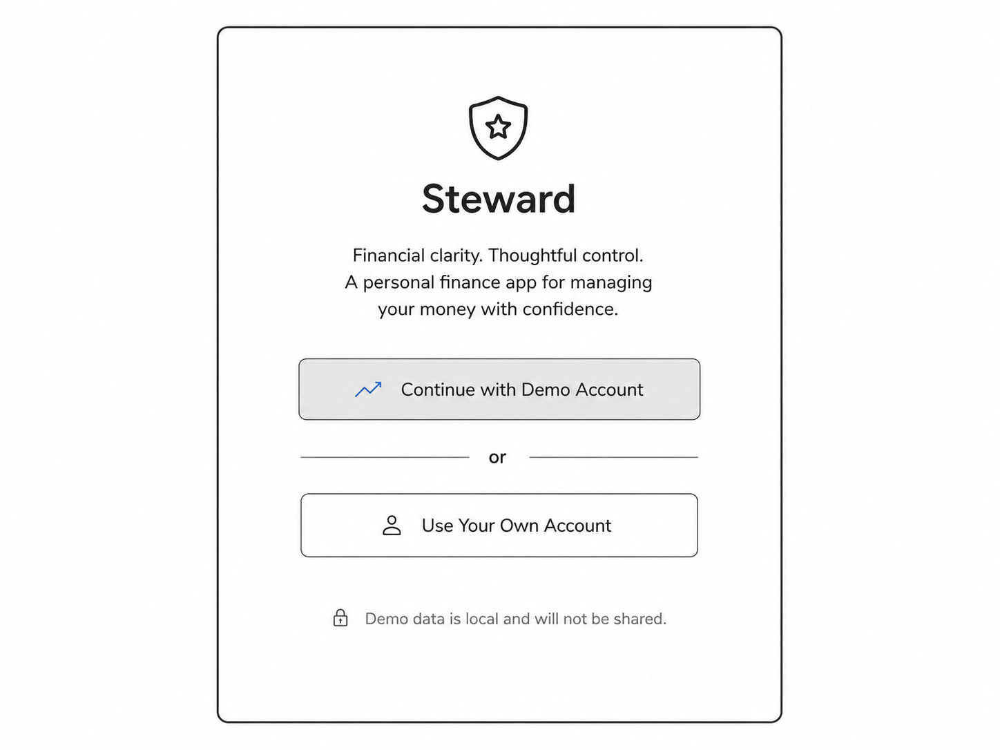
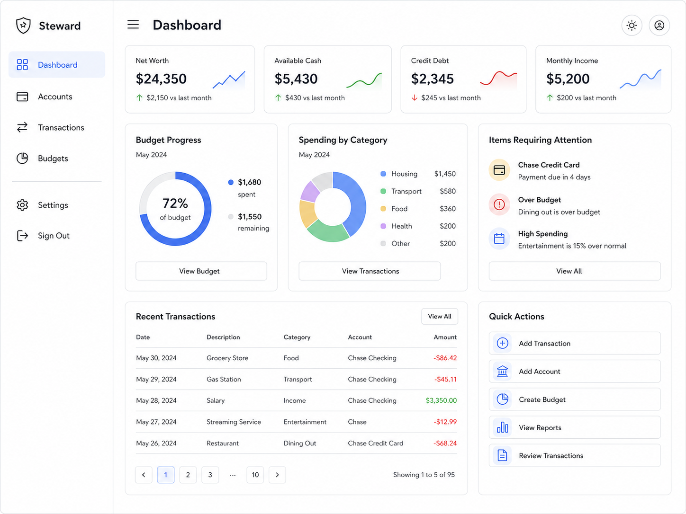
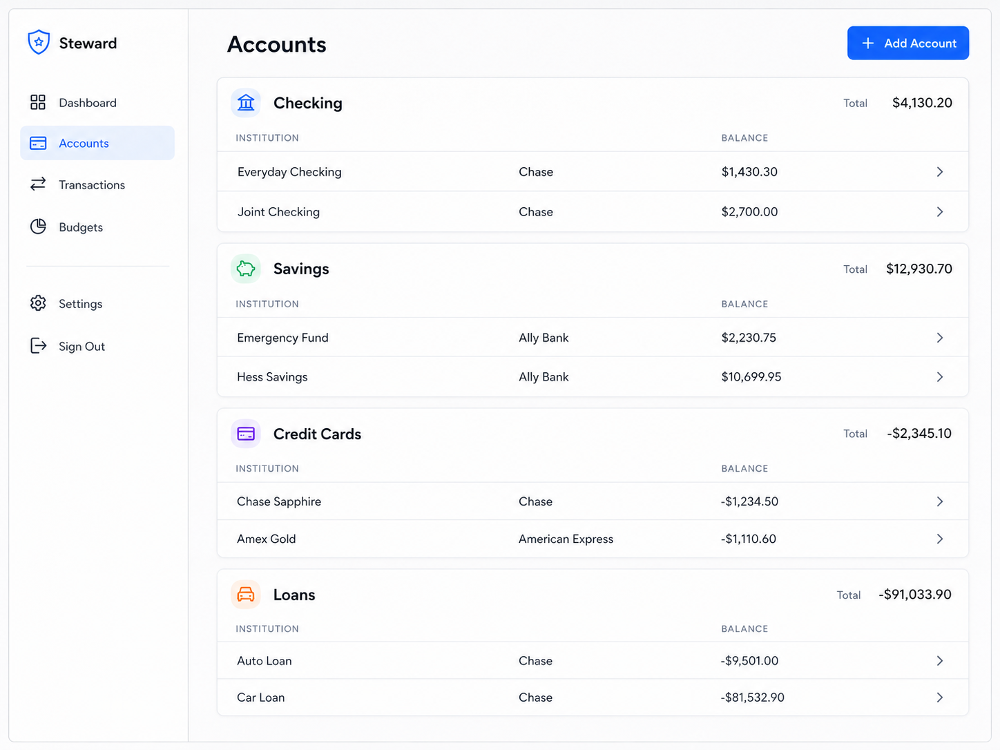
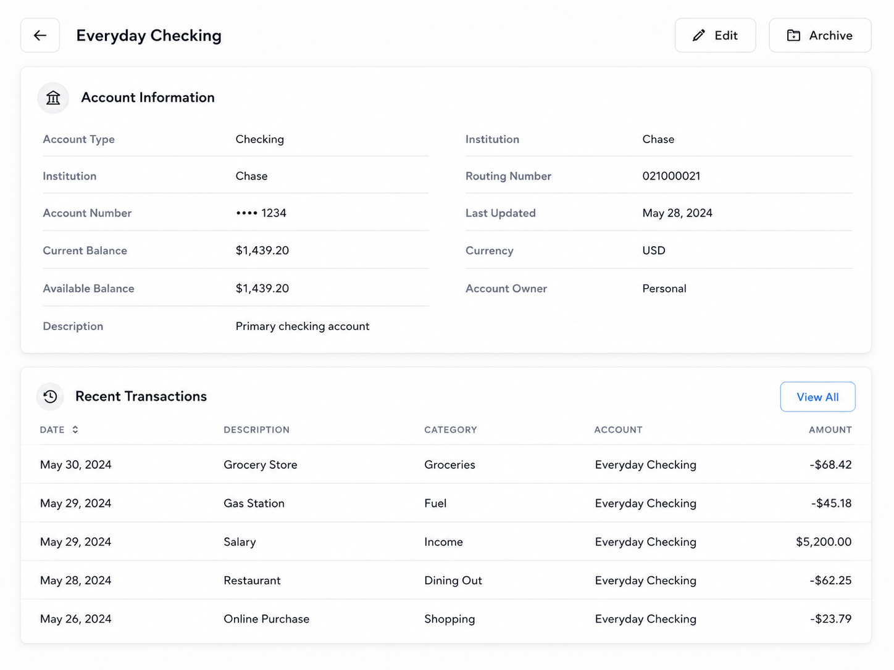
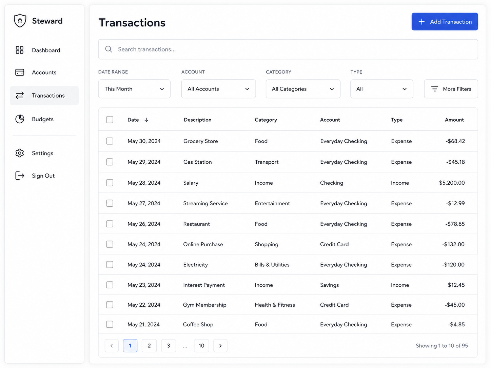
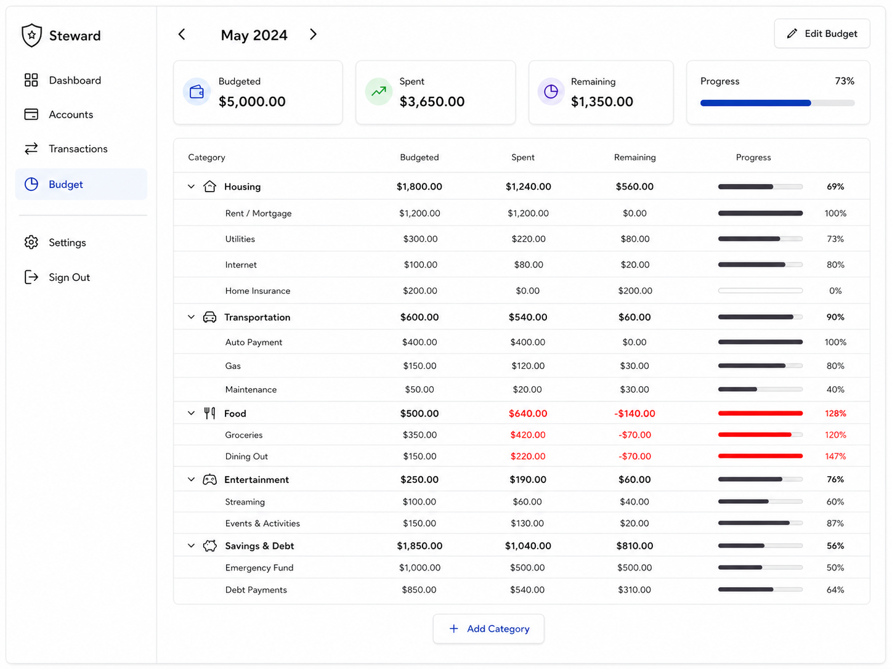
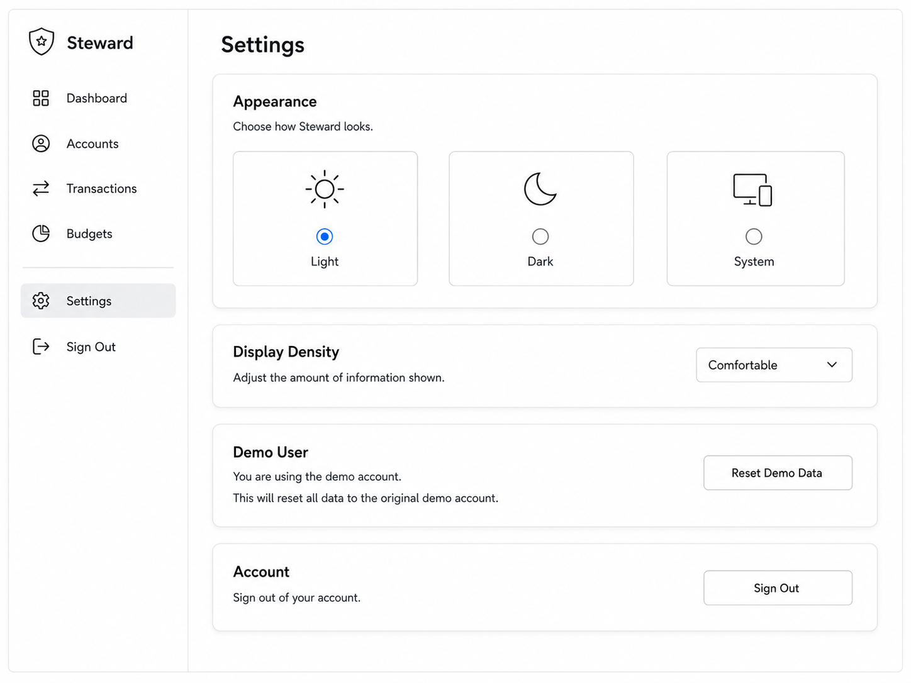

# Screen Designs

**Status:** Draft pending implementation validation
**Last verified:** 2026-07-30

These wireframes communicate information hierarchy, not exact dimensions. Shared behavior is defined in [patterns](patterns.md), and visual tokens are defined in [foundations](foundations.md).

## Login

The page contains email and password sign-in, links to registration, and a prominent `Continue with Demo` action. Authentication and demo actions have independent pending and error states.

## Dashboard

The dashboard prioritizes:

1. Available cash and credit debt
2. Monthly income and spending
3. Budget progress
4. Recent transactions
5. Spending by category
6. Deterministic attention items

Each summary links to its related detail view. Metric definitions come from [financial rules](../../domain/financial-rules.md).

## Accounts

Active accounts are grouped by type. The page offers Add account and Show archived. Each account exposes its name, type, formatted balance, and detail action.

## Account Details

The page shows account metadata, calculated balance, recent related transactions, edit, and archive. Permanent deletion is not presented for an account with history.

## Transactions

The collection supports search, approved filters, sorting, pagination, Add transaction, per-row edit, and per-row delete. Creation supports Income, Expense, and Refund—not Transfer.

## Budgets

The page shows month navigation, summary totals, grouped category allocations, progress, and edit mode. Copy-from-prior-month is not shown in the MVP.

## Settings

Settings is simplified to read-only identity, theme selection, conditional demo reset, and sign out. Financial preferences and password management are deferred.
